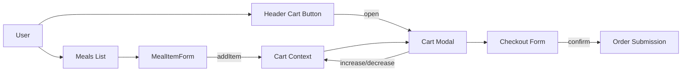
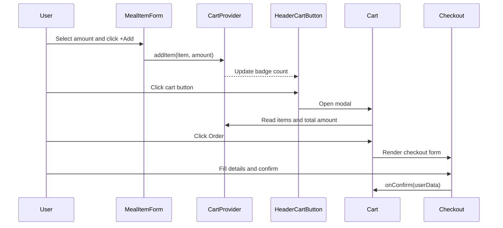

# React Food App

A React-based food ordering app where users can browse meals fetched from a Firebase backend, add items to a cart, manage quantities, and place an order through a validated checkout form.

## What This Project Does

- Fetches the list of meals from a Firebase Realtime Database, with loading and error states
- Lets users add meals with a chosen quantity
- Tracks cart state globally with React Context and a `useReducer` reducer
- Displays cart contents in a modal
- Supports increment/decrement actions per cart item
- Collects and validates customer details in checkout before confirmation
- Submits the order to a Firebase backend and clears the cart on success

## Tech Stack

- React 17
- Context API + `useReducer` for state management
- Firebase Realtime Database (REST endpoints) for meals and orders
- CSS Modules for scoped styling
- Create React App tooling (`react-scripts`)

## Project Structure

```text
src/
  App.js
  index.js
  index.css
  assets/
    meals.jpg
  components/
    Cart/
      Cart.js
      CartIcon.js
      CartItem.js
      Checkout.js
    Layout/
      Header.js
      HeaderCartButton.js
    Meals/
      Meals.js
      MealsSummary.js
      AvailableMeals.js
      MealItem/
        MealItem.js
        MealItemForm.js
    UI/
      Card.js
      Input.js
      Modal.js
  store/
    cart-context.js
    CartProvider.js
```

## Application Flow



## Sequence Diagram (Add to Cart and Checkout)



## State Management Notes

`src/store/CartProvider.js` holds shared cart state with `useReducer` and exposes actions via `src/store/cart-context.js`.

Context value:

- `items`: current selected cart items
- `totalAmount`: running total price
- `addItem(item)`: dispatches `ADD` — adds a new item or increases its quantity
- `removeItem(id)`: dispatches `REMOVE` — decreases quantity or removes the item when it reaches zero
- `clearCart()`: dispatches `CLEAR` — resets the cart after a successful order

## Backend

The app talks to a Firebase Realtime Database over REST:

- `GET /meals.json` — loads the available meals in `src/components/Meals/AvailableMeals.js`
- `POST /orders.json` — submits an order in `src/components/Cart/Cart.js`

The base URL is currently hard-coded in those components.

## Getting Started

### Prerequisites

- Node.js (LTS recommended)
- npm

### Install Dependencies

```powershell
npm install
```

### Run in Development

```powershell
npm start
```

### Build for Production

```powershell
npm run build
```

### Run Tests

```powershell
npm test
```

## Typical User Journey

1. User views the meals list.
2. User adds one or more items with quantity.
3. User opens the cart and adjusts items.
4. User proceeds to checkout.
5. User enters delivery details and confirms.

## Future Improvements

- Move the Firebase base URL into an environment variable instead of hard-coding it
- Persist the cart in `localStorage`
- Add error handling around order submission (currently only the happy path is handled)
- Expand reducer and component test coverage
- Improve UX feedback and accessibility on the checkout form

